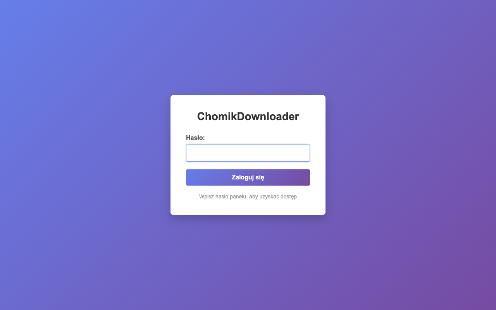
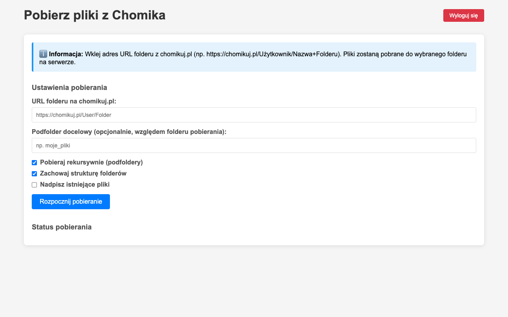
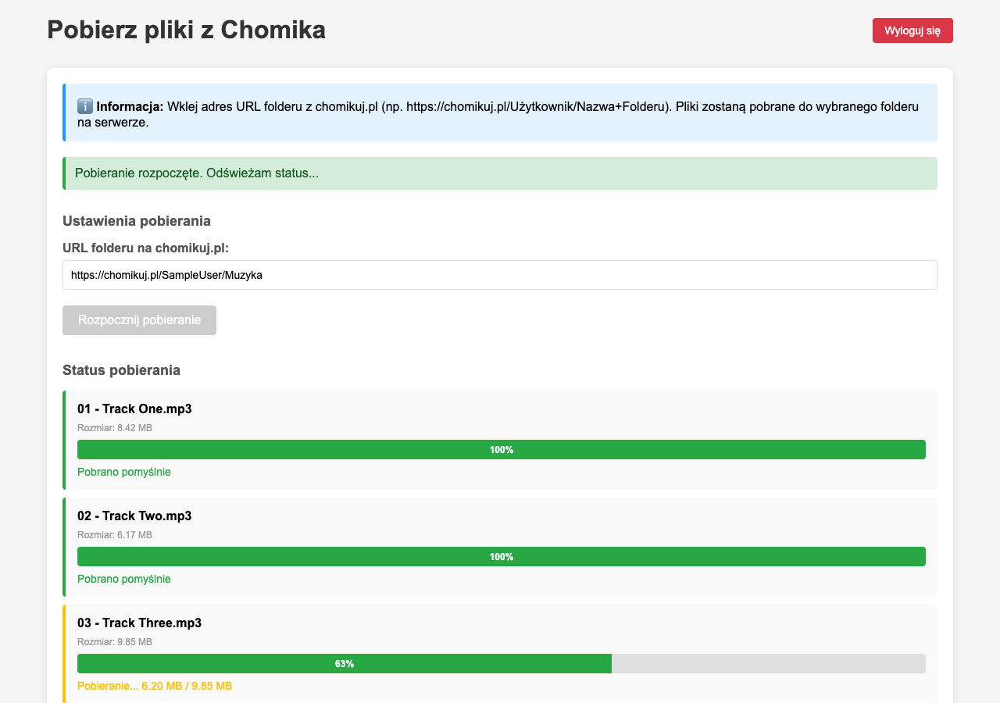

# Chomik Web Downloader

A self-hosted web app for downloading files and folders from [chomikuj.pl](https://chomikuj.pl) directly to your NAS. Built with Synology in mind, but it runs anywhere Docker does. Paste a folder URL, pick your options, and watch real-time progress in the browser. Also ships with a CLI for scripting.

Built with Python 3 and Flask. Runs as a Docker container or standalone.

---

## Screenshots

**Login screen** (optional panel password)



**Download form**



**Live progress tracking**



---

## Features

- Paste any `chomikuj.pl` folder URL and download everything inside it
- Real-time per-file progress bars in the browser
- Recursive subfolder downloads
- Optional folder structure preservation (mirrors the source layout)
- Skip existing files or overwrite, your choice
- Optional web panel password protection
- Docker support with a single `docker compose up`
- CLI mode for automation and scripting
- Filter downloads by file extension
- Skip files above a size limit
- Handles filename collisions automatically (renames to `file (2).ext`, etc.)
- Resumes partial downloads

---

## Quick start (Docker)

Create a `.env` file:

```env
CHOMIK_USERNAME=your_chomikuj_login
CHOMIK_PASSWORD=your_chomikuj_password
PANEL_PASSWORD=optional_web_panel_password
SECRET_KEY=change-me-to-something-random
```

Then run:

```bash
docker compose up --build
```

Open [http://localhost:8001](http://localhost:8001). Files are saved to `./downloads` on the host.

---

## Running locally

```bash
pip install -r requirements.txt

export CHOMIK_USERNAME=your_login
export CHOMIK_PASSWORD=your_password
export PANEL_PASSWORD=optional_panel_password   # omit to disable login
export DOWNLOAD_FOLDER=./downloads

python3 app.py
```

Open [http://localhost:5000](http://localhost:5000).

---

## CLI

```bash
python3 chomik.py \
  --user YOUR_LOGIN \
  --password YOUR_PASSWORD \
  --url "https://chomikuj.pl/Username/FolderName" \
  -r -s downloads
```

### Required flags

| Flag | Description |
|------|-------------|
| `--user`, `-u` | Your chomikuj.pl username |
| `--password`, `-p` | Plaintext password |
| `--hash` | MD5 hash of your password (alternative to `--password`) |
| `--url` | Folder or file URL on chomikuj.pl |

Provide either `--password` or `--hash`, not both.

### Optional flags

| Flag | Description |
|------|-------------|
| `--recursive`, `-r` | Download subfolders recursively |
| `--structure`, `-s` | Preserve the folder layout from chomikuj.pl |
| `--overwrite`, `-o` | Overwrite existing files |
| `--noprogress`, `-n` | Suppress progress output |
| `--ext` | Only download these extensions, e.g. `pdf,epub,mobi` |
| `--max-limit` | Skip files larger than this many bytes |
| `destination` | Destination folder (default: current directory) |

### Examples

```bash
# Download a full folder tree, keep structure
python3 chomik.py -u USER -p PASS \
  --url "https://chomikuj.pl/Username/FolderName" -r -s downloads

# Download only PDFs from a single folder
python3 chomik.py -u USER -p PASS \
  --url "https://chomikuj.pl/Username/FolderName" --ext pdf
```

### Output layout (with `-s`)

```
downloads/
  Username/
    Folder/
      file1.pdf
      file2.epub
```

---

## Environment variables

| Variable | Required | Default | Description |
|----------|----------|---------|-------------|
| `CHOMIK_USERNAME` | Yes | | Your chomikuj.pl login |
| `CHOMIK_PASSWORD` | Yes | | Your password |
| `PANEL_PASSWORD` | No | (none) | Web panel password; omit to disable login |
| `SECRET_KEY` | No | `change-me` | Flask session secret |
| `DOWNLOAD_FOLDER` | No | `/app/downloads` | Where files are saved |
| `STATE_FILE` | No | `<DOWNLOAD_FOLDER>/jobs_state.json` | Job history file; keep it on persistent storage so jobs survive a restart |
| `MAX_JOBS` | No | `50` | Max retained jobs; oldest *finished* jobs are pruned beyond this |

> **Job history & restarts.** Jobs are persisted to `STATE_FILE`, so closing the browser tab and
> reopening it shows running and past jobs (the page reconnects automatically — no localStorage). A
> server restart kills the in-flight download thread, so any job that was running is marked
> **Przerwane** (interrupted) on next boot; use **Uruchom ponownie** (re-run) to restart it —
> partially downloaded files resume at byte level via existing `.part` files. Run a single process
> (the default `python app.py`); a multi-worker WSGI setup would each keep separate state.

---

## Debug files

If a download fails, these files appear in the project root and contain the raw SOAP request/response:

- `debug_download_info_request.xml`
- `debug_download_info.xml`
- `debug_download_files_request.xml`
- `debug_download_files.xml`

Safe to delete at any time.

---

## Requirements

- Python 3.8+
- `flask` and `requests` (see `requirements.txt`)
